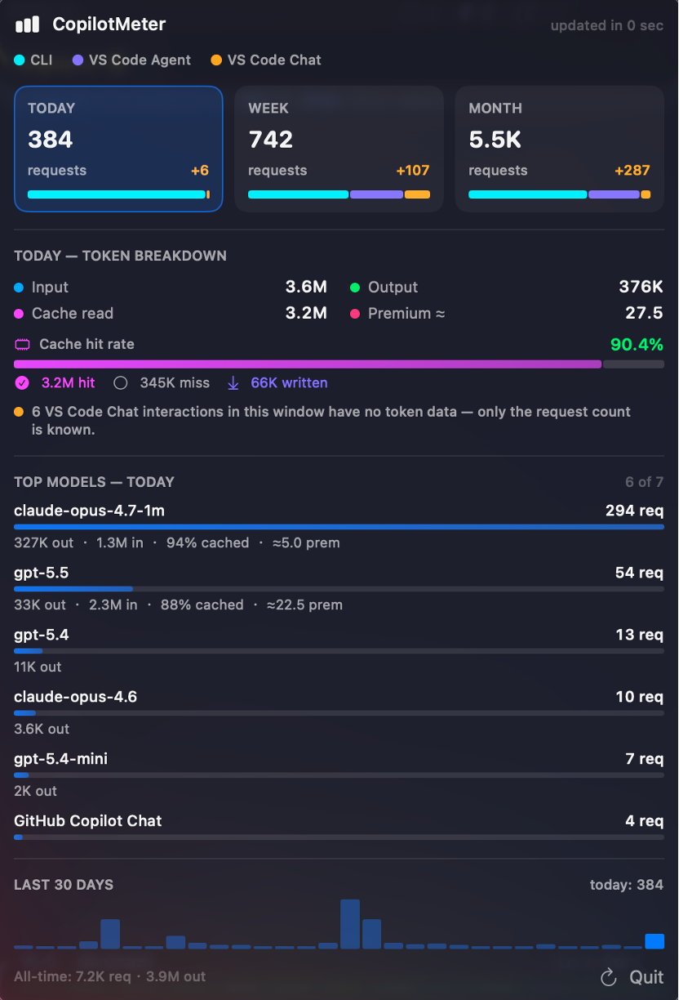

<p align="center">
  
</p>

<h1 align="center">CopilotMeter</h1>

A tiny native macOS menu-bar app that tracks **how much you're actually using GitHub Copilot** — today / 7-day / 30-day breakdown, cache-hit rate, per-model split, and a USD cost estimate, all from a glance.

<p align="center">
  
</p>

Works for any Copilot plan, but **especially valuable for GitHub Copilot Enterprise users**: your seat is "Unlimited", the official dashboard at <https://github.com/settings/billing/usage> reports 0 % forever, and there is no API for per-turn token data. CopilotMeter parses the same local files Copilot writes anyway and gives you a real number.

Pro / Pro+ / Business users still get a nicer, always-visible breakdown than the web dashboard — without leaving the menu bar.

## Privacy &amp; safety

- **No login.** Doesn't ask for your GitHub credentials, OAuth token, or any API key. There's literally no auth flow.
- **Only two network endpoints, both passive:**
  - SSH to hosts *you* tick in the popover (for tracking your own remote dev boxes — disabled by default).
  - `api.github.com` once a week to check `releases/latest` for a new version (no auth, no payload, no identifying headers; disable with `defaults write dev.local.CopilotMeter disableUpdateChecks 1`).
- **No telemetry, no crash reporters, no third-party SDKs.** Single Swift binary, sandbox-friendly.
- **Reads only locally-written Copilot session-state.** Specifically:
  - `~/.copilot/session-state/<sid>/events.jsonl` — for CLI / Agent token rollups
  - `~/Library/Application Support/Code/User/{globalStorage,workspaceStorage}/.../github.copilot-chat/...` — for Chat request counts (prompt text is **never** loaded into the app's memory — see `VSCodeChatTranscriptsReader.swift` / `VSCodeChatReader.swift`)
- **Nothing is uploaded.** All aggregation happens on your Mac and is stored at `~/Library/Application Support/CopilotMeter/cache.db`. Uninstall by deleting that directory + `/Applications/CopilotMeter.app`; no leftovers elsewhere.

Open source under MIT, so feel free to audit the ~1.2 MB of Swift before installing.

## Lightweight by design

| | Size |
|---|---|
| `.dmg` download | ~ 900 KB |
| Installed `.app` bundle | 1.6 MB |
| Native arm64 binary | 1.2 MB |
| Resident memory while running | ~ 45 MB |
| CPU when idle | 0 % |
| Local refresh tick | every 60 s (parses only the new tail of each `events.jsonl` / transcript) |
| Remote refresh tick | every 1 h (incremental; typically < 1 KB of SSH traffic per host after the first sync) |

No background daemons, no helper tools. The whole app is one Swift binary linked against system frameworks (no Electron, no embedded Node/Python runtime — the small Python extractor we ship is only ever piped over SSH to remote hosts, never spawned locally).

## 📣 News

- **v0.1.23** — **Fix: remote-host chip showed "0" for VS-Code-Chat-only hosts.** Since v0.1.16 made AI Credits the primary metric, hosts where the user runs *only* VS Code Copilot Chat (no terminal `copilot` CLI) rendered as "0 credits" and got filtered out of the menu-bar breakdown entirely — even though their request_count was non-zero. The reason: GitHub only emits `totalNanoAiu` for Copilot CLI sessions, not for Chat, so chat-only rows have `ai_credits_nano = NULL`. The popover *Remote hosts* chip now reads e.g. **"@host 6 req"** instead of "@host 0", and the menu-bar breakdown surfaces them as **"host:6r"**. Tooltips explain why no credit data is available + suggest running `copilot` on the remote to surface credits. No data ingestion or pricing-math change — purely a display fix.
- **v0.1.22** — **Real Mac-native goal celebration.** The v0.1.21 emoji-cycle in the menu bar was replaced with a full-screen `CAEmitterLayer` celebration overlay: three timed firework bursts (additive-blended, radial), confetti rain across the top edge, and a centered "Daily goal complete!" hero label with a gradient-stroked checkmark + a soft system "Glass" chime. The overlay is borderless, click-through, floats above all apps via `.screenSaver` window level, joins all Spaces, and tears itself down after ~5 s. In the menu bar the AI-Credits number still flips to the orange→pink→purple→blue gradient (with a `checkmark.seal.fill` instead of the bar-chart icon) for the rest of the day. The popover panel also has a new ✨ "Preview" button so you can replay the celebration without waiting to hit your goal.
- **v0.1.21** — **Daily AI-Credits goal + menu-bar fireworks 🎉.** New *Daily goal* panel in the popover lets you set a target in AI Credits (1 credit = $0.01). Progress bar tracks toward it; when today's usage crosses the goal, the menu bar fires a 6-second emoji-frame fireworks burst (🎉 ✨ 🎆 🎇 🪅) and switches the credit number to a colored orange→pink→purple→blue gradient with a green ✓. The colored state persists until midnight (your local timezone) so the bar visibly says "done for today". The animation only fires once per day per goal, so it won't keep replaying every refresh.
- **v0.1.20** — **Critical popover fix.** v0.1.19's ScrollView wrap regressed: inside `MenuBarExtra(style: .window)` a bare `ScrollView` has no intrinsic vertical content size, so the popover collapsed to a thin sliver. v0.1.20 measures the inner content with a `GeometryReader + PreferenceKey` and pins the ScrollView height to `min(measuredContent, 80% of visibleFrame)`. The popover now fits its content exactly and only scrolls when content actually overflows the 80% cap.

## Install

```bash
curl -fsSL https://raw.githubusercontent.com/zhongjiechen/CopilotMeter/main/Scripts/install.sh | bash
```

Or download `CopilotMeter.dmg` from the [latest release](https://github.com/zhongjiechen/CopilotMeter/releases/latest). The DMG is ad-hoc signed (not notarised), so if double-clicking gives *"Apple cannot verify..."*, run:

```bash
xattr -d com.apple.quarantine ~/Downloads/CopilotMeter.dmg
open ~/Downloads/CopilotMeter.dmg
```

Then drag CopilotMeter to `/Applications` and add it to **System Settings → General → Login Items**.

## Tracking remote machines (optional)

Open the popover → expand **Remote hosts** → tick any host from your `~/.ssh/config`. CopilotMeter pipes a small Python extractor over SSH and pulls only the token-relevant events:

| | First sync | Incremental |
|---|---|---|
| Network | ~3 MB | ~1 KB |
| Time | ~30 s | ~5 s |
| Local disk | 4 KB | (unchanged) |

No user prompts or assistant responses ever leave the remote. Auto-refreshes hourly.

## Data sources

| Source | Where | Token data? |
|---|---|---|
| Copilot CLI | `~/.copilot/session-state/<sid>/events.jsonl` | ✅ full |
| VS Code Agent (local) | same path — invoked by VS Code Chat in Agent mode | ✅ full |
| VS Code Agent (remote vscode-server) | `workspaceStorage/<wkHash>/GitHub.copilot-chat/transcripts/<sid>.jsonl` | ❌ count-only [^1] |
| VS Code Ask / Edit Chat | central `globalStorage/.../session-store.db` + transcripts | ❌ count-only [^1] |
| Cloud Agent (cloud-dispatched) | events.jsonl with `hostType=github` | ✅ full |
| Remote hosts | extracted over SSH from each remote's own data dirs | same per-source as above |
| Cache | `~/Library/Application Support/CopilotMeter/cache.db` | — |

[^1]: VS Code Copilot Chat marks token-bearing `assistant.usage` events as `ephemeral` and filters them out before writing to disk, so per-turn input/output token counts simply aren't available on the local filesystem. We can only count requests for those sources.

No network calls except the SSH to enabled remotes.

## Build from source

```bash
git clone https://github.com/zhongjiechen/CopilotMeter.git
cd CopilotMeter
make app             # builds & assembles CopilotMeter.app
make dmg             # builds & packages CopilotMeter.dmg
make install         # copies to /Applications
```

Requires Apple Silicon + Xcode CLT (Swift 5.9 +).

## License

MIT — see [LICENSE](LICENSE).
